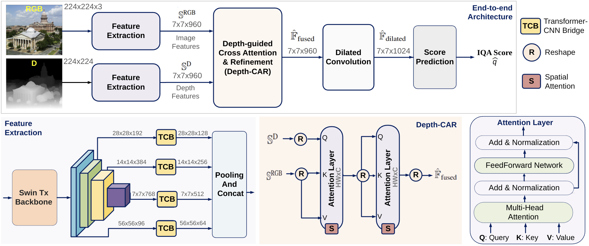

# DGIQA: Depth-guided Feature Attention and Refinement for Generalizable Image Quality Assessment

This repository contains the implementation of **DGIQA**, a no-reference image quality assessment model that fuses RGB and depth features via Transformer–CNN bridges(TCB) and depth-guided cross attention and refinement(DCAR). Our approach leverages depth information to help the model prioritize salient and closer objects in the scene, significantly enhancing its generalization. DGIQA achieves SOTA perfromance in benchmark datasets and excels in assessing unseen distortions.

**Paper**:  
> [**DGIQA: Depth-guided Feature Attention and Refinement for Generalizable Image Quality Assessment**]()  
> Vaishnav Ramesh, Junliang Liu, Haining Wang, Md Jahidul Islam.   


<p align="center">
  
</p>

## Installation

```bash
git clone https://github.com/uf-robopi/DGIQA.git
cd DGIQA
conda create -n dgiqa python=3.10 -y
conda activate dgiqa
conda install pytorch torchvision cudatoolkit=11.8 -c pytorch -c nvidia
pip install -r requirements.txt
```

## Pretrained Weights

Pretrained models are available for:

- KADID10K  
- KonIQ-10k  

Weights can be downloaded from [Dropbox](https://www.dropbox.com/scl/fo/j0b2989bw643rs62zhybc/ABOjncdXtyySxsYm4DFoDIs?rlkey=stkaxq09czt51bsdayn96dgwt&st=1qwdjss0&dl=0) . 

Use with `--model_weights` in inference scripts.

## Inference

Compute a quality score for one image:

```bash
python single_image_inference.py --img_path /path/to/image.png  --model_weights pretrained_weights/DGIQA_Koniq10k.pth --encoder vitl --crops 20
```

* `--img_path`: path to your RGB image
* `--model_weights`: path to pretrained DGIQA `.pth` file
* `--encoder`: DepthAnything encoder variant (`vits`, `vitb`, `vitl`)
* `--crops`: number of random 224×224 crops (default: 20)

**Output**: averaged MOS score in \[0,1].

## Citation

## Acknowledgements

We thank the authors of [DepthAnything](https://github.com/LiheYoung/Depth-Anything.git) for their excellent open-source code and pretrained models, which we use in this project for depth map generation and as a component of our inference pipeline.
